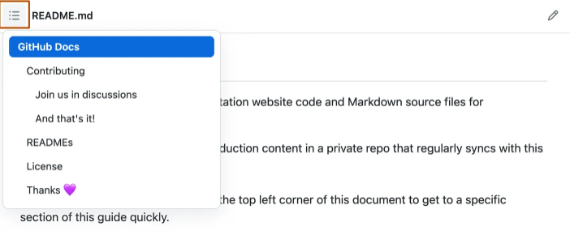
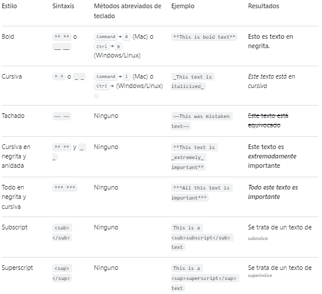
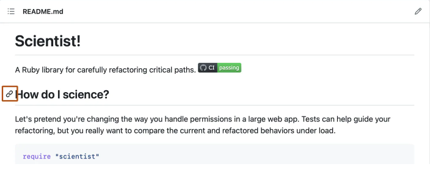

# Encabezados

Para crear un encabezado, agrega entre uno y seis símbolos # antes del encabezado del texto. El número de # que utilices determinará el nivel jerárquico y el tamaño tipográfico del encabezado.

# A first-level heading
## A second-level heading
### A third-level heading

Al usar dos o más encabezados, GitHub genera automáticamente una tabla de contenido a la que puede acceder haciendo clic en  dentro del encabezado del archivo. Todos los títulos de encabezado aparecen en la tabla de contenido, y puede hacer clic en un título para ir a la sección seleccionada.



# Estilos de texto

Puedes indicar énfasis con texto en negrita, cursiva, tachado, o de subíndice o superíndice en los campos de comentarios y archivos .md.



# Entrecomillado de texto

Puede entrecomillar texto con >.

> Text that is a quote

Al texto entre comillas se le ha aplicado sangría y tiene un color de tipo diferente.

>Nota: Al visualizar una conversación, puedes citar automáticamente el texto en un comentario resaltándolo y escribiendo R. Para citar un comentario completo; para ello, haz clic en  y, a continuación, en Citar respuesta. Para obtener más información acerca de los métodos abreviados de teclado, consulte "Accesos directos del teclado.

# Código de cita

Puedes indicar un código o un comando dentro de un enunciado con comillas simples.

Use `git status` to list all new or modified files that haven't yet been committed.

Para formatear código o texto en su propio bloque distintivo, usa comillas triples.

```
git status
git add
git commit
```

# Modelos de color compatibles

En los problemas, las solicitudes de incorporación de cambios y los debates, puedes llamar a los colores dentro de una oración mediante comillas simples.

The background color is `#ffffff` for light mode and `#000000` for dark mode.

Estos son los modelos de color admitidos actualmente.

Color | Sintaxis | Ejemplo | Resultados
--- | --- | --- | ---
HEX | \`#RRGGBB\` | \`#0969DA\` | Captura de pantalla de GitHub Markdown que muestra cómo aparece el valor HEX #0969DA con un círculo azul.
RGB | \`rgb(R,G,B)\` | \`rgb(9, 105, 218)\` | Captura de pantalla de GitHub Markdown que muestra cómo aparece el valor RGB 9, 105, 218 con un círculo azul.
HSL | \`hsl(H,S,L)\` | \`hsl(212, 92%, 45%)\` | Captura de pantalla de GitHub Markdown que muestra cómo aparece el valor HSL 212, 92 %, 45 % con un círculo azul.

# Vínculos

Puede crear un vínculo en línea escribiendo su texto entre corchetes [ ] y escribiendo la URL entre paréntesis ( ).

This site was built using [GitHub Pages](https://pages.github.com/).

# Enlaces de sección

Puede vincular directamente a una sección en un archivo representado si desliza el puntero sobre el encabezado de la sección para exponer .

También puedes crear un hipervínculo de Markdown resaltando el texto y usando el método abreviado de teclado Comando+V. Si quieres reemplazar el texto por el vínculo, usa el método abreviado de teclado Comando+Mayús+V.



# Vínculos relativos

Puedes definir enlaces relativos y rutas de imagen en los archivos representados para ayudar a que los lectores naveguen hasta otros archivos de tu repositorio.

[Contribution guidelines for this project](docs/CONTRIBUTING.md)

# Imágenes

Puede mostrar una imagen agregando ! y ajustar el texto alternativo en [ ]. Luego, escribe el vínculo de la imagen entre paréntesis ().


# Especificar un tema en el que se muestra una imagen

Puedes especificar el tema para el que se muestra una imagen en Markdown mediante el elemento <picture> de HTML en combinación con la característica de elementos multimedia prefers-color-scheme.

# Listas

Puedes crear una lista sin ordenar. Para ello, coloca -, * o + antes de una o más líneas de texto.

- George Washington
- John Adams
- Thomas Jefferson

Para ordenar tu lista, antecede cada línea con un número.

1. James Madison
2. James Monroe
3. John Quincy Adams

# Listas anidadas

Puedes crear una lista anidada al dejar sangría en uno o más elementos de la lista debajo de otro elemento.

# Listas de tareas

Para crear una lista de tareas, debe añadir como prefijo un guion y espacio, seguido de [ ] a los elementos de la lista. Para marcar una tarea como completada, use [x].

# Mencionar personas y equipos

Puede mencionar a una persona o equipo en GitHub, Para ello, escriba @ junto con su nombre de usuario o equipo.

# Hacer referencia a propuestas y solicitudes de extracción

Puede mencionar una lista de las incidencias y solicitudes de incorporación de cambios dentro del repositorio escribiendo #.

# Hacer referencia a recursos externos

Si se configuran las referencias autovinculadas personalizadas para un repositorio, entonces las referencias a recursos externos, como un informe de problemas de JIRA o un ticket de Zendesk, se convertirán en vínculos acortados.

# Cargar activos

Puedes cargar activos como imágenes si las arrastras y sueltas, las seleccionas de un buscador de archivos o si las pegas.

# Usar emojis

Puedes agregar emoji a la escritura escribiendo :EMOJICODE:.

# Párrafos

Puedes crear un nuevo párrafo al dejar una línea en blanco entre las líneas de texto.

# Notas al pie

Puedes agregar notas al pie para tu contenido si utilizas esta sintaxis de corchetes.

# Alertas

Las alertas son una extensión Markdown basada en la sintaxis blockquote que puede utilizar para resaltar la información crítica.

# Ocultar el contenido con comentarios

Puedes decirle a GitHub que oculte el contenido del lenguaje de marcado interpretado colocando el contenido en un comentario de HTML.

# Ignorar formato de Markdown

Puede pedirle a GitHub que ignore (u omita) el formato de Markdown escribiendo \ antes del carácter de Markdown.

# Inhabilitar la representación del lenguaje de marcado

Cuando ves un archivo de lenguaje de marcado, puedes hacer clic en el Código en la parte superior de este para inhabilitar la representación de lenguaje de marcado y ver en su lugar el código fuente del archivo.


